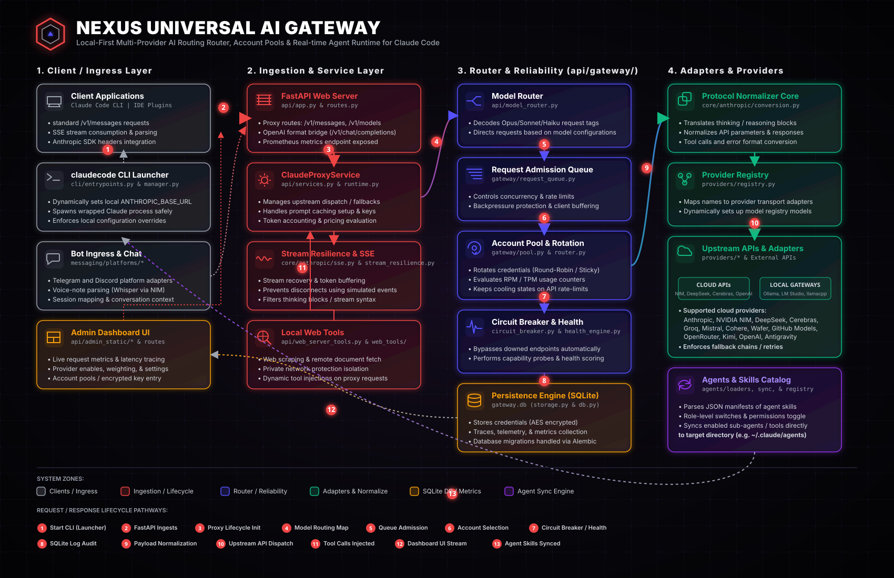
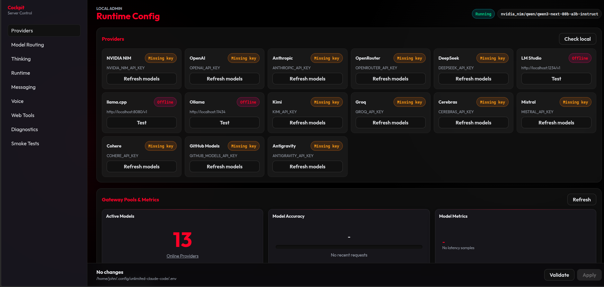

# Nexus
## Universal AI Gateway & Agent Runtime

Run Claude Code across multiple model providers through one gateway.

Nexus keeps Claude Code compatibility while adding routing, failover, account pools, dashboard operations, and agent skills sync.


<p align="center">
  
</p>

## Why Nexus?

Claude Code alone is great, but teams and power users usually need more runtime control.

Nexus exists to solve practical problems:

- Provider outage or temporary API errors -> route to fallback provider automatically
- Quota/key exhaustion -> rotate to another account/provider
- Mixed stack needs -> run cloud providers and local models behind one endpoint
- Operational visibility -> monitor requests, latency, queue, retries, and failures
- Agent workflow management -> import/enable/sync agent skills from dashboard

## Quick Start (2 minutes)

```bash
cd /path/to/workspace
git clone <your-repo-url> nexus
cd nexus

uv sync
cp .env.example .env
```

Set minimum `.env` values:

```dotenv
ANTHROPIC_AUTH_TOKEN="freecc"
GATEWAY_ENCRYPTION_KEY="replace-with-a-long-random-secret"
MODEL="nvidia_nim/z-ai/glm4.7"
```

Run:

```bash
# terminal 1
uv run fcc-server

# terminal 2
uv run fcc-claude
```

Server URLs:

- API: `http://127.0.0.1:8082`
- Admin Dashboard: `http://127.0.0.1:8082/admin`

## Feature Comparison (Practical)

| Feature | Claude Code (direct) | Nexus |
| --- | --- | --- |
| Multiple providers behind one endpoint | ❌ | ✅ |
| Automatic failover between providers/accounts | ❌ | ✅ |
| Account pools and rotation | ❌ | ✅ |
| Local admin dashboard | ❌ | ✅ |
| Cost/usage dashboard panels | ❌ | ✅ |
| Local model routing (Ollama/LM Studio/llama.cpp) | ❌ | ✅ |
| Agent catalog import + sync controls | ❌ | ✅ |

## Architecture (Simple)

```text
Claude Code
   ↓
Nexus Gateway
   ↓
OpenAI / Anthropic / Groq / OpenRouter / DeepSeek / Local Models
```

Nexus preserves Claude-facing Anthropic behavior (`/v1/messages`, `/v1/models`, SSE streaming), then routes upstream using provider health, account state, and routing strategy.

## Supported Providers

From `config/provider_catalog.py`.

Cloud/API-key providers:

- `openai`, `anthropic`, `open_router`, `groq`, `deepseek`, `nvidia_nim`
- `cerebras`, `mistral`, `cohere`, `kimi`, `github_models`
- `wafer`, `opencode`

Local providers:

- `ollama`, `lmstudio`, `llamacpp`

OAuth ecosystem paths present:

- Google OAuth config (`GOOGLE_OAUTH_CLIENT_ID`, `GOOGLE_OAUTH_CLIENT_SECRET`)
- GitHub OAuth config (`GITHUB_OAUTH_CLIENT_ID`, `GITHUB_OAUTH_CLIENT_SECRET`)
- `antigravity` provider entry exists in catalog (`http://127.0.0.1:4141/v1` default)

## Common Use Cases

### 1) Claude Code with automatic fallback

Set primary provider and fallback chain in routing rules. If provider fails/cools down, Nexus continues via the next eligible provider.

### 2) Cloud + local hybrid runtime

Use local `ollama/lmstudio/llamacpp` for some tasks and cloud providers for heavier tasks, all under one gateway endpoint.

### 3) Agent workflows across providers

Manage skills/agents in dashboard, then sync enabled agents to Claude-compatible target directories.

### 4) Multi-account dev environments

Add multiple accounts per provider, enable/disable per account, and let routing/health logic rotate usage.

## Demo

Current screenshot:

<p align="center">
  
</p>

Recommended additions (placeholders):

- `docs/media/provider-failover.gif` (provider fallback in action)
- `docs/media/dashboard-live.gif` (dashboard live metrics)
- `docs/media/claude-through-nexus.gif` (Claude Code routed through Nexus)
- `docs/media/agents-sync.gif` (agent import + sync)

## Dashboard Capabilities

In `/admin` you can:

- Enable/disable providers
- Add multiple provider accounts and toggle each account
- Configure routing and fallback behavior
- View usage, cost, health, cooldown, queue, traces, recent requests
- Start OAuth connect flows for Google/GitHub (when OAuth env is configured)
- Manage agents: rescan/import/sync, role-level and sub-agent toggles

Guide:

- [Dashboard Guide (HTML)](./docs/dashboard-guide.html)

## Agents & Claude Skills

Nexus includes agent registry + sync components (`agents/` + dashboard controls).

Important env keys:

```dotenv
AGENTS_REPO_PATHS="/absolute/path/to/claude-skills"
AGENTS_SYNC_TARGETS="/home/<user>/.claude/agents"
AGENTS_CUSTOM_ROOT=""
AGENTS_AUTODETECT_ON_STARTUP=true
AGENTS_AUTO_SYNC_ON_STARTUP=false
```

Typical workflow:

1. `Rescan Agents`
2. `Import All Skills`
3. Enable/disable role/sub-agents
4. `Sync Enabled Agents`

## Using Claude Code in Any Folder

Run server from Nexus repo, run Claude in any project directory.

```bash
# terminal 1
cd /path/to/nexus
fcc-server

# terminal 2
cd /path/to/your-project
fcc-claude
```

If Claude opens the wrong folder, check shell wrappers/functions overriding `fcc-claude`.

## Why Not Just Use Claude Code Directly?

Use direct Claude Code if you only need one provider and no gateway controls.

Use Nexus when you need:

- provider flexibility
- fallback and retries
- account pooling/rotation
- routing control and observability
- local model support
- dashboard-managed agent operations

while keeping Claude Code-compatible request behavior.

## Why Nexus Instead of LiteLLM?

LiteLLM is strong for general multi-provider proxying.

Nexus focuses on this specific local-first workflow:

- Claude Code compatibility as a first-class target
- Built-in local admin dashboard for runtime operations
- Provider/account pool controls tied to gateway health/cooldown behavior
- Agent/skills management and sync surface in the same runtime

If your priority is Claude Code-centered orchestration with dashboard controls, Nexus is optimized for that path.

## Performance & Reliability Layers

Nexus runtime includes (codebase-level):

- provider health scoring
- circuit breaker framework
- bounded async request queue
- retry + fallback orchestration
- cooldown handling
- queue/metrics tracing and event streaming paths

These reduce failure blast radius and improve request continuity under provider instability.

## Configuration Reference

Start with `.env.example`. Key groups include:

- Server/runtime: host/port/timeouts/rate limits
- Storage: SQLite default, optional Postgres settings
- Queue/event backend: local default, optional Redis settings
- OAuth: Google/GitHub client settings
- Agents: repo/sync/autodetect settings

Default local data paths:

- Managed env: `~/.config/nexus/.env`
- Gateway DB: `.config/nexus/gateway.db`
- Log file: `server.log`

## Contributing

Contributions are welcome.

Suggested flow:

1. Create feature/fix branch
2. Add/adjust tests in `tests/` (and `smoke/` when relevant)
3. Run:
   - `uv run pytest -q`
4. Keep changes modular (provider/auth/router separation)
5. Open PR with clear scope and migration notes

## Roadmap (Realistic, Non-Hype)

Potential next improvements:

- Stronger packaged docs for OAuth provider app setup
- More benchmark/report visualizations in dashboard
- Additional provider adapters and capability probes
- Docker deployment presets with cleaner defaults
- Deeper Redis/Postgres production mode hardening

## Security Notes

Before public push:

- Do not commit `.env`
- Do not commit `.config/` runtime DB files
- Do not commit logs containing sensitive payloads
- Rotate any previously exposed API keys/tokens

## Useful Commands

```bash
# tests
uv run pytest -q

# run gateway
uv run fcc-server

# run Claude through gateway
uv run fcc-claude

# global install from local repo path
uv tool install --force /absolute/path/to/nexus
```

## License

Choose and add your project license file before publishing publicly.
